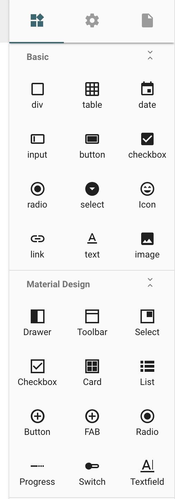
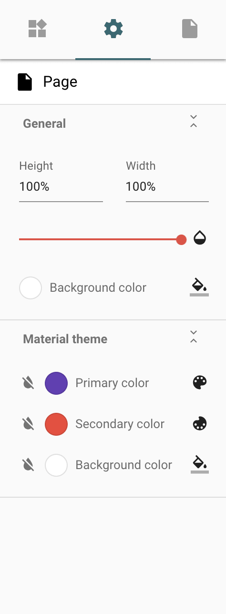
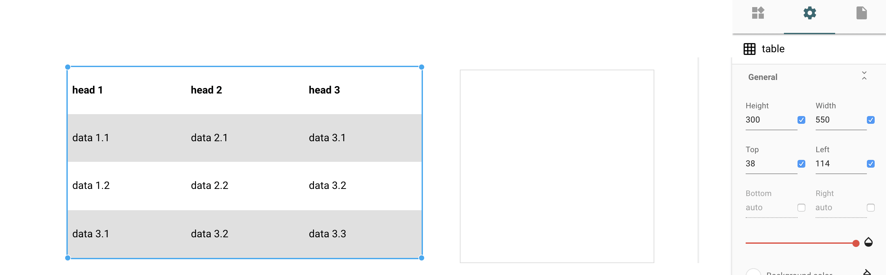
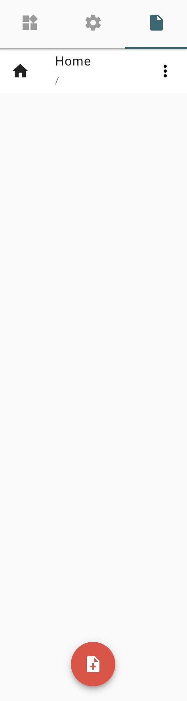

## drawegg

- [ ] [ElementsMenu](#ElementsMenu)
- [ ] [settings](#settings-menu)
- [ ] [pages](#pages-menu)

---

<details>

<summary>默认界面</summary>




</details>


---

其实, 前端的所有操作, 都是用户完成的, 当然我们可以初始化界面的表现

但, 随后的变化, 是跟随用户的脚步👣走的

所以我认为, 只要函数命名准确, 单从 `模版-template|html` 的角度

我们就能纵观数据的大概流向

<details>

说到底不就是

全局缓存「vuex」+ 本地缓存」+ 局部缓存「单个Vux」+ 远程缓存「Api」 = 数据 

显示 + 隐藏 .etc = 视图 

同步 + 异步 + 过滤 + Api请求「甚至可以归类成异步」= 行为 

所以才叫 `MvvC` - `Vue`

</details>

---

### drawegg-index

`src/components/editor/drawer/index.vue`

``` html
<template>
  <nav class="navigation">
    <div class="tab-bar">
      <a title="Elements" class="tab" @click="toggleTab('elements')">
        <svgicon icon="system/widgets" width="24" height="24"
          :color="showElements ? '#2b6a73' : 'rgba(0,0,0,.38)'">
        </svgicon>
      </a>
      <a title="Settings" class="tab" @click="toggleTab('settings')">
        <svgicon icon="system/settings" width="24" height="24"
          :color="showSettings ? '#2b6a73' : 'rgba(0,0,0,.38)'">
        </svgicon>
      </a>
      <a title="Pages" class="tab" @click="toggleTab('pages')">
        <svgicon icon="system/page" width="24" height="24"
          :color="showPages ? '#2b6a73' : 'rgba(0,0,0,.38)'">
        </svgicon>
      </a>

      <div class="tab-indicator mdc-theme--primary-bg" :style="{'left': indiLeft, 'right': indiRight}"></div>
    </div>

    <div class="tab-content">
      <ElementsMenu v-show="showElements"></ElementsMenu>
      <settings-menu v-show="showSettings"></settings-menu>
      <pages-menu v-show="showPages"></pages-menu>
    </div>
  </nav>
</template>
```

1. 三个小界面选择

- `ElementsMenu 「默认」`
- `settings-menu`
- `pages-menu`

``` js
  mounted: function () {
    this.$nextTick(() => {
      this.showElements = true
      this.showSettings = false
      this.showPages = false
    })
  },
```

### ElementsMenu

<details>

元素-默认界面


</details>

``` js
// js
import ElementsMenu from './elements/ElementsMenu'
```

``` html
    <menu-toggle menuHeader="Basic">
      <div class="el-menu">
        <div class="el-menu__el" :key="element.name"
          v-for="element in elements"
          :title="element.name"
          draggable="true"
          @dragstart="e => dragstartHandler(e, element)"
          @click="e => addItemToStage(e, element)"
        >
          <svgicon :icon="'system/elements/'+element.name" width="24" height="24" color="rgba(0,0,0,.87)"></svgicon>
          <span>{{element.displayName || element.name}}</span>
        </div>
      </div>
    </menu-toggle>

    <menu-toggle menuHeader="Material Design">
      <div class="el-menu">
        <div class="el-menu__el" :key="mdComp.name"
          v-for="mdComp in mdComponents"
          :title="mdComp.name"
          draggable="true"
          @dragstart="e => dragstartHandler(e, mdComp)"
          @click="e => addItemToStage(e, mdComp)"
        >
          <svgicon :icon="'system/elements/'+mdComp.iconName" width="24" height="24" color="rgba(0,0,0,.87)"></svgicon>
          <span>{{mdComp.displayName || mdComp.name}}</span>
        </div>
      </div>
    </menu-toggle>
```

1. 默认元素 和 Material元素

2. 点击 和 按住开始 操作

#### click

``` js
    addItemToStage (e, item) {
      this.registerElement({pageId: this.activePage.id, el: this.initItem(item), global: e.shiftKey})
    },
```

`shiftKey`事件属性可返回一个布尔值，指示当事件发生时，"SHIFT" 键是否被按下并保持住。

> 页面, 元素内容, 是否按住 "SHIFT"

为全局`state.project.components`添加或更新次数

和 更新页面孩子列表

---

#### dragstart

`e` 是 拖动的 DOM实例
`item` 是需要的可视化元素

``` js
    dragstartHandler (e, item) {
      e.dataTransfer.dropEffect = 'copy'
      e.dataTransfer.effectAllowed = 'all'
      e.dataTransfer.setData('text/plain', JSON.stringify(this.initItem(item)))
    },
```

- copy: 复制到新的位置
- all: 允许所有的操作.
- setData: 为一个给定的类型设置数据

> 当拖动到需要放下的DOM时候, 可以通过 `getData` 获得 数据

一个完整的拖动放下, 是需要两个区块的, 现在我们拿起来了,

我们会再画布那里设置放下 [跳着去看看画布的放下也可以](./editor.main.md#drop)

[mdn-dataTransfer](https://developer.mozilla.org/zh-CN/docs/Web/API/DataTransfer#setData.28.29)

[HTML Drag and Drop API](https://developer.mozilla.org/en-US/docs/Web/API/HTML_Drag_and_Drop_API)


### settings-menu

<details>

<summary>setting-默认界面</summary>



</details>

<details>

<summary>setting-选择元素后-界面</summary>



</details>

### pages-menu

<details>

<summary>page-默认界面</summary>



</details>