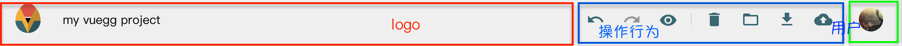

## headgg

导航分三部分

1. [x] [logo](#logo)

2. [x] [操作行为](#操作行为)

3. [x] [用户](#用户)

---



---

其实, 前端的所有操作, 都是用户完成的, 当然我们可以初始化界面的表现

但, 随后的变化, 是跟随用户的脚步👣走的

所以我认为, 只要函数命名准确, 单从 `模版-template|html` 的角度

我们就能纵观数据的大概流向

<details>

说到底不就是

全局缓存「vuex」+ 本地缓存」+ 局部缓存「单个Vux」+ 远程缓存「Api」 = 数据 

显示 + 隐藏 .etc = 视图 

同步 + 异步 + 过滤 + Api请求「甚至可以归类成异步」= 行为 

所以才叫 `MvvC` - `Vue`

</details>

---

### logo

`client/src/components/editor/header/index.vue`

1. 显示Logo

2. 改变项目标题

``` html
<template>
  <div class="headegg mdc-theme--background" :class="{'not-scrolled': scroll0}">
    <a class="home-btn" href="https://vuegg.github.io/" target="_blank">
      <svgicon icon="product/vuegg" width="40" height="40" :original="true"></svgicon>
    </a> 
    <!-- Logo -->

    <input class="title-input" v-model="tmpProjectTitle" @blur="onTitleBlur"
      title="Project title" placeholder="Project title"/>
<!-- 项目名称 -->
    <div class="spacer"></div>
    <action-bar></action-bar> <!-- 操作行为 -->
    <user-menu></user-menu> <!-- 用户 -->
  </div>
</template>
```

``` js
import { updateProject } from '@/store/types'

import UserMenu from './UserMenu'
import ActionBar from './ActionBar'

import '@/assets/icons/product/vuegg'

export default {
  name: 'headegg',
  components: { ActionBar, UserMenu },
  props: ['scroll0'],
  data: function () {
    return {
      tmpProjectTitle: ''
    }
  },
  computed: mapState({
    project: state => state ? state.project : {},
    projectTitle: state => state ? state.project.title : '' // 从这里拿到 项目默认标题  🌟
  }),
  methods: {
    onTitleBlur () { // 更新项目名称
      if (this.tmpProjectTitle && (this.tmpProjectTitle !== this.projectTitle)) {
          // 通过 全局 store 更新
        this.updateProject({title: this.tmpProjectTitle}) // 操作 会改变 state.project.title 进而 -> 🌟
      } else {
        this.tmpProjectTitle = this.projectTitle // 当为空的时候, 标题重置
      }
    },
    ...mapMutations([updateProject])
  },
  created: function () {
    this.tmpProjectTitle = this.projectTitle // 创建后, 赋值一次
  },
  watch: {
    'projectTitle': function (val) {
      this.tmpProjectTitle = val // 连接 全局 - 局部 
    }
  }
}
```

## 操作行为

`client/src/components/editror/header/ActionBar.vue`

1. [前进/回退](#前进-回退)

2. [预览 ](#预览)

3. [删除](#删除)

4. [打开](#打开)

5. [下载](#下载)

6. [上传](#上传)

> 😯噢, 我们来接导线吧, 当然我们会分开

### 前进-回退

1. 回退

对全局缓存进行,根目录级的回退 「操作后」

2. 前进

对全局缓存进行,根目录级的前进, 「回退后」

``` html
    <button v-tooltip="'Undo'" class="action-btn" :disabled="!canUndo" @click="$root.$emit('undo')">
      <svgicon icon="system/actions/undo" width="24" height="24"
        :color="canUndo ? '#2b6a73' : 'rgba(0,0,0,.38)'">
      </svgicon>
    </button>

    <button v-tooltip="'Redo'" class="action-btn" :disabled="!canRedo" @click="$root.$emit('redo')">
      <svgicon icon="system/actions/redo" width="24" height="24"
        :color="canRedo ? '#2b6a73' : 'rgba(0,0,0,.38)'">
      </svgicon>
    </button>
```

``` js
$root.$emit('undo') // 这是来自哪里了
$root.$emit('redo')
```

记得 [`client.md` 中 的 `mixins`](./client.md#redoundo) 吗, 没错😊

### 预览

很明显, 路由变化

``` html
    <button v-tooltip="'Preview'" class="action-btn">
      <router-link to="preview"> 
      <!-- 路由变化 -->
        <svgicon icon="system/actions/preview" width="24" height="24" color="#2b6a73"></svgicon>
      </router-link>
    </button>
```

### 删除

1. 打开 删除 dialog

`import ConfirmDialog from '@/components/editor/dialogs/ConfirmDialog'`

``` html
    <button v-tooltip="'Clear project'" class="action-btn"
      :disabled="isLoading" @click="$root.$emit('open-confirm-dialog')">
      <svgicon icon="system/actions/delete" width="24" height="24" color="#2b6a73"></svgicon>
    </button>
```


### 打开

1. 从 本地-pc 打开 「来自下载的按钮」

2. 从 github 项目 打开


``` html
    <mdc-menu-anchor>
      <button v-tooltip="'Open...'" class="action-btn" :disabled="isLoading" @click="showLoadFromMenu">
        <svgicon icon="system/actions/folder" width="24" height="24" color="#2b6a73"></svgicon>
      </button>
      <mdc-menu ref="loadFromMenu" @select="onSelectLoadFrom">
        <mdc-menu-item disabled>Open project:</mdc-menu-item>
        <mdc-menu-divider></mdc-menu-divider>
        <mdc-menu-item>
          <input type="file" ref="inputOpenLocal" @change="openLocalFile" :value="fileValue" accept=".gg"/>
          Computer
        </mdc-menu-item>
        <mdc-menu-item>GitHub</mdc-menu-item>
      </mdc-menu>
    </mdc-menu-anchor>
```

### 下载

1. 一个是单下载-项目加密的状态 (.gg)

2. 状态解析生成 `vue` 源项目 (.zip)

``` html
    <mdc-menu-anchor>
      <button v-tooltip="'Download...'" class="action-btn" :disabled="isLoading" @click="showDownloadMenu">
        <svgicon icon="system/actions/download" width="24" height="24" color="#2b6a73"></svgicon>
      </button>
      <mdc-menu ref="downloadMenu" @select="onSelectDownload">
        <mdc-menu-item disabled>Download:</mdc-menu-item>
        <mdc-menu-divider></mdc-menu-divider>
        <mdc-menu-item>Vuegg project (.gg)</mdc-menu-item>
        <mdc-menu-item>Vue sources (.zip)</mdc-menu-item>
      </mdc-menu>
    </mdc-menu-anchor>
```

### 上传

1. 打开 上传 dialog

`import UploadDialog from '@/components/editor/dialogs/UploadDialog'`

2. 三种 图片显示 {无法上传|上传更新|上传完成}

``` html
    <button v-tooltip="saveBtnTitle" class="action-btn" @click="$root.$emit('open-upload-dialog')"
      :disabled="!isLoggedIn || !hasChanges || (isLoggedIn && isLoading)"
    >
      <svgicon icon="system/actions/cloud_off" v-if="!isLoggedIn"
        width="24" height="24" color="rgba(0,0,0,.38)">
      </svgicon>
      <svgicon icon="system/actions/cloud_up" v-else-if="hasChanges"
        width="24" height="24" color="#2b6a73">
      </svgicon>
      <svgicon icon="system/actions/cloud_done" v-else
        width="24" height="24" color="rgba(0,0,0,.38)">
      </svgicon>
    </button>
```

---


## 用户

`client/src/components/editror/header/UserMenu.vue`

1. 登录github

``` js
    <button class="avatar-btn" v-if="!loggedUser" @click="logIn" :disabled="!loginBtnEnabled" v-tooltip="'Login with GitHub'" >
      <svgicon icon="system/gh_logo" width="100%" height="100%"
        :color="loginBtnEnabled ? '#2b6a73': 'rgba(0,0,0,.38)'">
      </svgicon>
    </button>
```

概括一下, `logIn` 做了什么

- 对github应用中心请求-github用户数据, 传回来 一个`密码`

``` js
authUrl = 'https://github.com/login/oauth/authorize'
    .concat('?client_id=').concat(CLIENT_ID) // 应用ID
    .concat('&redirect_uri=').concat(REDIRECT_URL) // 返回URL
    .concat('&state=').concat(STATE) // 随机
    .concat('&scope=').concat(SCOPE) // 权限 默认 只读用户数据
```

- 将`密码`传到server端`/api/get-access-token`

- server端, 用`密码`和`应用主人信息`-拿到-密码相关-的用户`token`, 给会`client`

``` js
// server
    method: 'POST',
    uri: 'https://github.com/login/oauth/access_token',
    form: {
      client_id: process.env.CLIENT_ID, // 应用ID
      client_secret: process.env.CLIENT_SECRET,
      // <==== 这里是应用主人密钥
      code: code // 用户信息请求
```

- 到这里, `client`拿到了token, 标记 vuex-登录状态:`!!token`, 再带着`token`向github请求用户信息

``` js
await axios.get('https://api.github.com/user', {
      headers: {
        'Authorization': 'bearer '.concat(token)
      }
    })
```

- 终于, 拿到用户数据, 将获得的`token`和`user`等 保存`本地缓存`与`vuex`

---

2. 注销

``` html
    <mdc-menu-anchor v-if="loggedUser">
      <button class="avatar-btn" @click="showUserMenu">
        
      </button>
      <mdc-menu ref="userMenu" @select="onSelect">
        <mdc-menu-item disabled>
          <div class="menu-title">
            <span class="name">{{loggedUser.name || loggedUser.login}}</span>
            <span class="login">@{{loggedUser.login}}</span>
            
          </div>
        </mdc-menu-item>
        <mdc-menu-divider></mdc-menu-divider>
        <mdc-menu-item>Logout</mdc-menu-item>
      </mdc-menu>
    </mdc-menu-anchor>
```

注销相对简单多了

- 清空本地缓存

- 清空vuex-用户

- 其中-登录状态:`false`